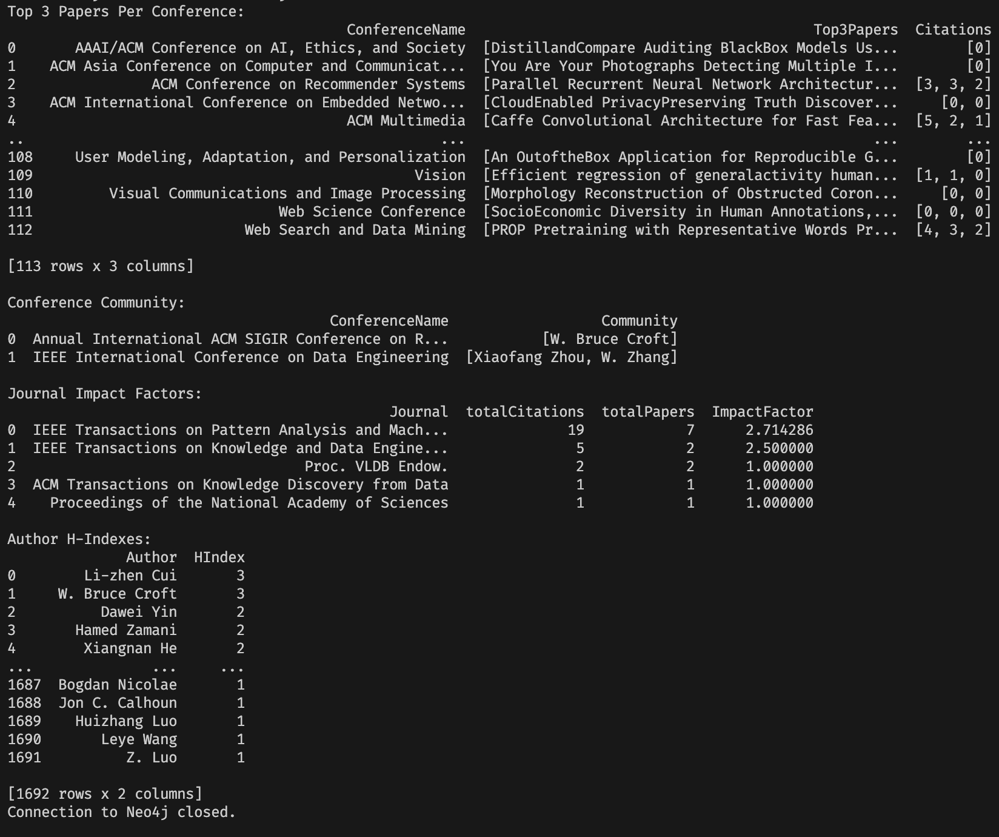
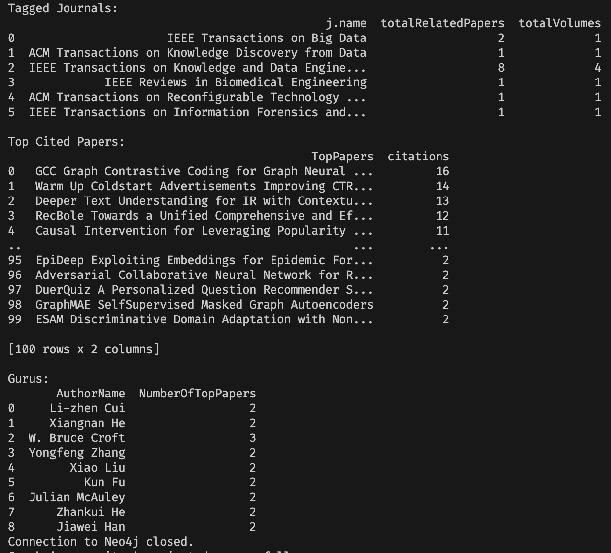
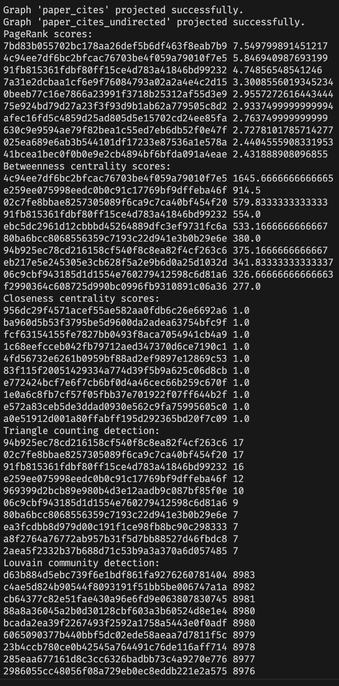
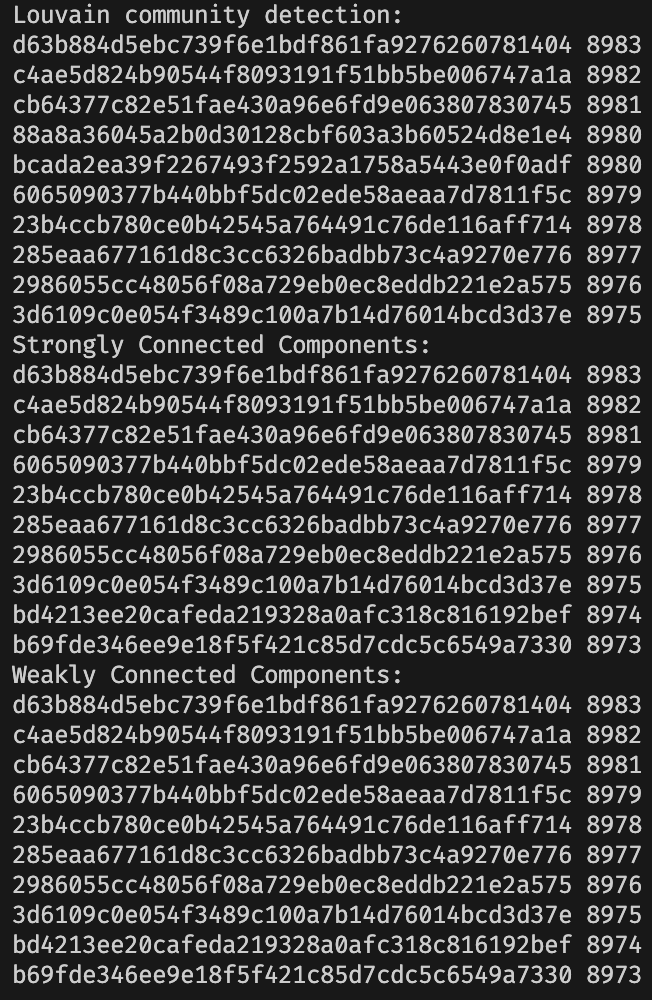

# Neo4J Property Graph Model of Semantic Scholar Papers Dataset

This README outlines the steps needed to set up and run the project environment, including installing necessary libraries, processing data, and loading it into a Neo4j database.

## Environment Setup

Ensure you have Python 3.9 installed on your system. You can check your Python version by running:

```bash
python --version
```

### Install Libraries

First, install the required libraries listed in `requirements.txt` by running the following command:

```bash
pip install -r requirements.txt
```

## Data Preparation

### Download Dataset

Download the dataset from the provided hyperlink. Ensure the downloaded dataset is saved in the project's root directory.

[Download Dataset](https://drive.google.com/drive/folders/19AC2DGWyPLi7hWFlZ3iDD1OgRLlNzxE9?usp=sharing)

### Data Transformation

Run the `etl.ipynb` Jupyter notebook to create necessary files from the dataset. Initially, `all_data.csv` will be used.

#### Skipping Keyword Creation

The keyword creation part of the ETL process is time-consuming. If you prefer to skip this step, directly use `all_data_with_keywords.csv` in the notebook instead of `all_data.csv`.

## Neo4j Database Setup

After processing the data, set up a Neo4j DBMS and obtain the path to its DBMS directory. On macOS, the path looks like this:

```
/Users/user/Library/Application%20Support/Neo4j%20Desktop/Application/relate-data/dbmss/<dbms-id>/import/csv_path.txt
```

Replace `<dbms-id>` with the appropriate folder name for your DBMS.

### Moving CSV Files

Move all the CSV files generated by `etl.ipynb` to the directory path you obtained in the previous step.

## Running the Data Pipeline

Execute the data pipeline with the following bash script command. Ensure to replace `--config` with your configuration file path, if necessary. Also, make the necessary modifications of the username, password, and database in the config file.

```bash
bash run_loader.sh --config config.ini
```

## Results

Below are the sample results we obtained from running the pipeline:





